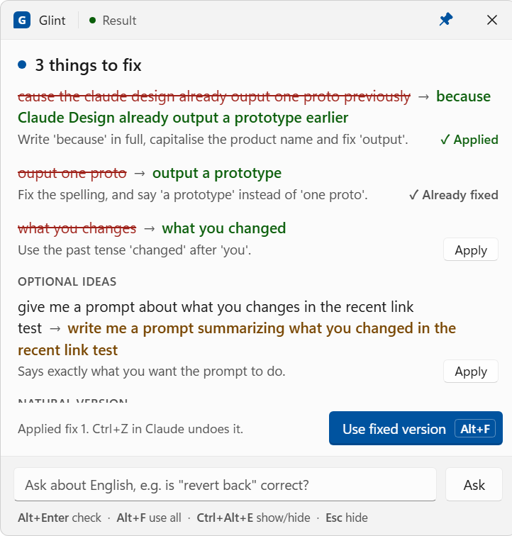

# Glint for Claude Code

Glint is grammar lint for your prompts: a Claude Code plugin for developers who are improving their written English. In the Claude desktop app, press **Alt+Enter** on Windows or **⌘Enter** on a Mac to check your draft before you send it. The suggestions appear in a small frosted-glass panel next to Claude, and nothing is added to your session. Enter and Shift+Enter work exactly as before.

The same panel lets you look up English phrases at any time (Ctrl+Alt+E on Windows, ⌃⌥E on a Mac). Every check is saved to a journal, so you can review your recurring mistakes.



## How it works

```
type your message in Claude
   │
   ├─ Alt+Enter ─► your draft is checked (about 2 s) ─► suggestions appear in the Glint panel
   │  (⌘Enter on a Mac)                                (the cursor stays in Claude's message box)
   │     edit your message yourself, click a fix's Apply, or use the whole fixed version (Alt+F, ⌥F on a Mac)
   │
   └─ Enter ─────► sent as usual. Any check result in the panel hides.
```

- **Only real mistakes count as mistakes.** That means grammar errors, wrong words, and Singlish that a colleague abroad could misread ("can help check?", "got error"). Informal but correct English like "What to do next?" or "Any idea why?" is fine.
- **Suggestions are optional ideas.** Wording that's correct but could sound more natural is listed as an optional idea.
- **The panel ignores what isn't your writing.** Code, paths, logs, error messages, and quoted or pasted text are never "corrected".

### Other modes

You can switch modes with `/glint:config <mode>`:

| Mode | What happens |
|---|---|
| `hotkey` (default) | Check only when you press Alt+Enter (⌘Enter on a Mac). Nothing appears in the session. |
| `gate` | Every prompt is checked when you press Enter. A prompt with mistakes is held back and the desktop app shows "Prompt blocked by a hook". Send it again, edited or as-is, and it goes through. Start a prompt with `*` to skip the check. |
| `inline` | The prompt goes straight to Claude, which adds the English feedback to the top of its reply. |

## Install

Requires Node.js 18 or later and the Claude CLI logged in to your account (`claude` in a terminal, then `/login`). Checks run through your own CLI login. The panel needs:

- **Windows:** [AutoHotkey v2](https://www.autohotkey.com/) and the Microsoft Edge WebView2 runtime, which comes with Windows 11.
- **macOS:** macOS 12 or later and the Xcode command line tools (`xcode-select --install`), to build the panel.

1. Get the code. The panel runs from this folder:

   ```bash
   git clone https://github.com/ccdr4gon/glint.git
   ```

2. Install the plugin:

   ```bash
   claude plugin marketplace add ccdr4gon/glint
   ```

   ```bash
   claude plugin install glint@prompt-optimizer
   ```

   To install from your clone instead, so your local changes are used, pass its path to `claude plugin marketplace add`.

3. Start the panel.

   **Windows:** double-click `tools/glint/glint-panel.ahk`. To start it with Windows, put a shortcut to it in the folder that opens with Win+R → `shell:startup`, and add `--hidden` to the shortcut's target so it starts in the background.

   **macOS:** build the app, then open it:

   ```bash
   bash tools/glint/mac/build.sh
   ```

   ```bash
   open tools/glint/mac/build/Glint.app
   ```

   macOS asks for Accessibility permission the first time. Turn on Glint in System Settings → Privacy & Security → Accessibility, and the panel starts working straight away. To start it when you log in, click Glint's icon in the menu bar and choose **Open at Login** (macOS 13 or later).

4. Start a new Claude Code session.

**Coming from English Coach?** Glint was called English Coach before version 0.4.0. Remove the old plugin with `claude plugin uninstall english-coach@prompt-optimizer`, then run `claude plugin marketplace update prompt-optimizer` and the install command above. Your journal and settings now live in `~/.claude/glint/`, so move `~/.claude/english-coach/` there if it still exists.

To update after changing the plugin, bump `version` in `plugins/glint/.claude-plugin/plugin.json`, then run:

```bash
claude plugin marketplace update prompt-optimizer
```

```bash
claude plugin update glint@prompt-optimizer
```

Then restart the panel: double-click the `.ahk` file again on Windows. On a Mac, run `bash tools/glint/mac/build.sh` again and open the app.

## The Glint panel

`tools/glint/glint-panel.ahk` is a frameless, always-on-top panel with Windows 11 Acrylic behind it. It shows the design from Claude Design (`design/`), with its own title bar: drag it to move the panel, use the pin to turn always-on-top on or off, and × to hide the panel. Drag any edge or corner to resize it.

| Key or button | What it does |
|---|---|
| **Alt+Enter** in the Claude desktop app | Checks your draft and shows the result. The panel reads your message through Windows UI Automation, the interface screen readers use, so nothing is copied and your clipboard is untouched. |
| A fix's **Apply** button | Changes just that phrase in your draft. The panel re-reads the draft first, so edits you made after the check are kept. Ctrl+Z in Claude undoes the change. If another, overlapping fix already changed those words, it shows "✓ Already fixed". If the words are gone from your message, nothing changes and the panel says so. |
| **Alt+F** in Claude or in the panel, or **Use fixed version** | Replaces your whole draft in Claude with the natural version. Press Enter to send. |
| **Enter** in Claude | Sends as usual, and hides the check result. |
| **Ctrl+Alt+E** anywhere | Shows or hides the panel, ready to type in the ask box. Ask anything, for example `how to say "this one cannot work already" politely to my lead` or `is "revert back" correct?`. |
| **Esc** | Hides the panel. |

Alt+F only takes over that key while there's a fixed version to use. At other times it reaches Claude as usual. There are no number shortcuts, so keys like Alt+1 stay free for your other tools.

The panel follows your Windows light or dark mode, and turns solid when Windows transparency effects are off. Start options:
- `--hidden` starts it in the background; Ctrl+Alt+E shows it.
- `--theme dark` or `--theme light` forces a theme.

You can change these options at the top of `glint-panel.ahk`:

| Option | Default | What it does |
|---|---|---|
| `HIDE_AFTER_SEND` | true | Hide a check result when you press Enter in Claude |
| `KEEP_WARM` | true | Keep one Claude process ready while the panel runs, so a check takes about 2 s instead of 4–7 s. It uses about 180 MB of memory. |
| `SHOW_KEY` | Ctrl+Alt+E | The key that shows or hides the panel. Alt+Enter and Alt+F are in the `#HotIf` blocks. |
| `EXTRA_TRANSPARENCY` | 0.10 | Makes the glass more see-through than the design. 0.10 lowers the tint from 82% to 72% opaque (84% to 74% in dark mode), and 0 keeps the design's look. Over very dark windows, grey text gets fainter as this goes up. |

Alt+Enter only works in the Claude desktop app. In a terminal, use `/glint:check <text>` instead, or switch to `gate` or `inline` mode.

**Plain fallback:** `glint-window.ahk` does the same job with standard Windows controls and no WebView2. Starting either one closes the other, so only one listens for Alt+Enter.

## The Glint panel on macOS

`tools/glint/mac/build/Glint.app` shows the same panel page in a window with macOS's own frosted glass behind it. It lives in the menu bar, not the Dock, and shows on whichever desktop (Space) you're on, over Claude in full screen too. Drag the title bar to move it, drag an edge to resize it, and use the pin and × as on Windows.

| Key or button | What it does |
|---|---|
| **⌘Enter** in the Claude desktop app | Checks your draft and shows the result, with the cursor still in Claude's message box. Claude doesn't see the key. |
| A fix's **Apply** button | Changes just that phrase in your draft. ⌘Z in Claude undoes it. |
| **⌥F** in Claude or in the panel, or **Use fixed version** | Replaces your whole draft in Claude with the natural version. Press Enter to send. |
| **Enter** in Claude | Sends as usual, and hides the check result. |
| **⌃⌥E** anywhere | Shows or hides the panel, ready to type in the ask box. |
| **Esc** | Hides the panel. |

⌘Enter only takes over that key while Claude is the app in front, and ⌥F only while there's a fixed version to use. At other times both reach your apps as usual. If you've set Claude to send messages with ⌘Enter, Glint's ⌘Enter replaces that, so send with Enter.

- **Accessibility permission.** Glint watches for ⌘Enter, Enter and ⌥F while Claude is in front, and presses ⌘A, ⌘C and ⌘V in Claude to read and change your message. Both need Accessibility permission. Glint only acts on those keys and passes everything else on untouched. ⌃⌥E is a standard system hotkey and needs no permission.
- **Your clipboard.** On a Mac, Glint reads your message by copying it (⌘A, ⌘C), because the copy's HTML keeps list numbers and `/command` chips. It then puts your clipboard back, so a check leaves it as it was. Apply and Use fixed version paste the same way. Everything Glint puts on the clipboard, your own content included, is marked with the [nspasteboard.org](http://nspasteboard.org) markers that clipboard managers such as Maccy, Paste and Raycast use to skip it.
- **Keyboard layouts.** Glint presses ⌘A, ⌘C and ⌘V by the letters they type in your keyboard layout, so they're right on AZERTY, Dvorak and "Dvorak - QWERTY ⌘" too.
- **After a rebuild.** `build.sh` signs the app ad hoc, so macOS treats each build as a new app. If ⌘Enter stops working after a rebuild, turn Glint off and on again in Accessibility, or remove it from the list and open the app again. To avoid this, sign with your own certificate: set `GLINT_SIGN_IDENTITY` to its name when you run `build.sh`.
- **Where it runs from.** The app runs the panel page and the plugin's scripts from the clone you built it in, so keep the clone where it is. The app itself can move, for example to `/Applications`. It runs `node` with your login shell's `PATH`, so Homebrew's and nvm's Node.js are found.

The panel follows your macOS light or dark mode, and turns solid when Reduce transparency is on (System Settings → Accessibility → Display). Start options, for example `open tools/glint/mac/build/Glint.app --args --hidden`:
- `--hidden` starts it in the background; ⌃⌥E shows it.
- `--theme dark` or `--theme light` forces a theme.

You can change `HIDE_AFTER_SEND`, `KEEP_WARM`, `SHOW_KEY` and `EXTRA_TRANSPARENCY` at the top of `tools/glint/mac/GlintPanel.swift`. They work as on Windows. Run `build.sh` again afterwards.

## Skills

| Command | What it does |
|---|---|
| `/glint:check <text>` | Proofread something you're about to send, such as a commit message, PR description, Slack message or email. You get a corrections table, a polished version in the right format, and a tip. |
| `/glint:review [N]` | Reads your last N journal entries (default 40). It shows your progress, whether you fixed mistakes yourself, your top recurring mistakes with real examples, the phrases you looked up, and practice sentences with answers. |
| `/glint:config [...]` | Shows or changes settings. For example: `/glint:config strict`, `/glint:config gate`, `/glint:config off`, `/glint:config reset` |

## Settings

| Setting | Default | Options |
|---|---|---|
| `enabled` | on | `on` / `off` |
| `mode` | `hotkey` | `hotkey`, `gate` or `inline` (see [Other modes](#other-modes)) |
| `model` | `claude-sonnet-5-5` | The model for checks and phrase lookups |
| `level` | `normal` | `light`: only clear mistakes, no optional ideas. `normal`: mistakes plus up to 2 optional ideas; casual chat style is ignored. `strict`: optional ideas and casual style ("plz", capitalisation, punctuation) count as mistakes. |
| `maxItems` | 5 | Maximum mistakes listed per check |
| `minWords` | 3 | Gate and inline modes: prompts with fewer prose words aren't checked |
| `copyOnBlock` | on | Gate mode: put a held-back prompt on the clipboard |
| `position` | `start` | Inline mode: feedback before (`start`) or after (`end`) Claude's answer |
| `rewrite` | `auto` | The full natural version. `auto` shows it for prompts up to about 120 words. Also `always` / `never`. |
| `journal` | on | Save checks and lookups for `/glint:review` |

## Speed and cost

- **Check time:** about 2 s when a Claude process is already warm (`KEEP_WARM`), and 4–7 s from a cold start.
- **Background helper:** checks go through a small background helper. It starts automatically, keeps one Claude process ready for each kind of request, and exits after 30 minutes without use. Run `node plugins/glint/scripts/glint.mjs daemon status` (or `stop`) to inspect it.
- **Cost:** each check or lookup is a small Sonnet call on your Claude plan, about $0.004–0.01 each at API prices. Hotkey mode only calls Claude when you press Alt+Enter (⌘Enter on a Mac).

## Your data

Everything stays on your machine in `~/.claude/glint/`. To use a different folder, set `GLINT_HOME`.

| File | What it holds |
|---|---|
| `config.json` | Your settings |
| `journal.jsonl` | Each check with its mistakes and optional ideas, what you sent after a check, and your phrase lookups. Delete it to start fresh. |
| `window/` | The latest check, for linking it to what you send, plus gate-mode feedback for the panel |
| `held/`, `pending/` | Short-lived gate and inline mode state |
| `webview2/` | The Windows panel's WebView2 data, such as its cache |
| `daemon.log`, `panel.log` | Logs from the helper and the panel, each capped at a few hundred KB |

This folder is deliberately outside the plugin, so your journal survives updates and reinstalls.

## How it works inside

```
plugins/glint/
├── .claude-plugin/plugin.json
├── hooks/hooks.json            UserPromptSubmit (60 s timeout) and Stop hooks
├── prompts/
│   ├── check-system.md         instructions for the check (Sonnet, structured JSON: mistakes + suggestions)
│   ├── ask-system.md           instructions for phrase lookups
│   └── coach-instructions.md   instructions Claude gets in inline mode
├── scripts/
│   ├── glint.mjs               hook handlers and the CLI (check, apply, ask, warm, config, journal, daemon)
│   ├── richtext.mjs            reads and writes the message box's HTML (keeps list numbers and /command chips)
│   ├── rtf.mjs                 formatted (RTF) results for the fallback window, in light and dark colours
│   ├── llm.mjs                 runs `claude -p`, through the helper or once directly
│   └── daemon.mjs              the background helper
├── skills/{check,review,config}/
└── tests/                      node:test suite with a fake `claude`
tools/glint/
├── glint-panel.ahk             the frosted-glass panel (WebView2 + Acrylic)
├── panel/glint-panel.html      the panel's page from Claude Design, renamed to Glint
├── lib/                        WebView2 bindings from thqby/ahk2_lib (MIT, see lib/SOURCE.md)
├── glint-window.ahk            the plain fallback window
├── glint-clipboard.ahk         copying and pasting the message box, text and HTML (used by both)
├── glint-uia.ahk               reading the message box through UI Automation, without the clipboard
├── test-window.ahk             end-to-end test of the fallback window
└── mac/
    ├── GlintPanel.swift        the macOS panel (AppKit + WKWebView over macOS's frosted glass)
    └── build.sh                builds it into mac/build/Glint.app
design/                         the Claude Design handoff (mockups and the original HTML, from before the rename)
.github/workflows/macos.yml     builds and self-tests the macOS panel, and runs the tests on macOS
```

- **The panel.** `glint-panel.ahk` shows `panel/glint-panel.html` (Claude Design's page with only the name changed) and drives it through its own interface:
  - It calls `window.glint.render(state)` with the JSON that `glint.mjs check`, `apply` and `ask` write to `<out>.json`.
  - The page sends back `apply`, `useFix`, `ask`, `pin` and `close` messages.
  - When the page loads, the panel adds the resize edges (the window has no frame) and the `EXTRA_TRANSPARENCY` tint. So a new Claude Design export, made from [docs/panel-design-prompt.md](docs/panel-design-prompt.md), can replace the file as it is.
- **Lists and commands.** Claude's message box copies itself twice. Its plain text leaves out a numbered list's numbers, and pasting plain text back turns a `/command` chip into ordinary words. Its HTML keeps both, so the panel copies that too.
  - `richtext.mjs` reads the HTML as text with "1. " and "- " written out, so the check sees your list.
  - **Apply** changes only that fix's words inside the HTML and pastes the HTML back, so lists, `/commands` and @mentions stay exactly as they were.
  - **Use fixed version** builds HTML from the fixed text, turning numbered lines back into a real list and restoring the chips.
- **Your clipboard.** Alt+Enter reads the message box through UI Automation (`glint-uia.ahk`). Its text includes the list numbers and `/command` chips, so nothing needs copying.
  - Apply and Use fixed version change your message, which needs a paste. They copy the box's HTML (Use fixed version only when there's an @mention) and paste, then put your clipboard back.
  - Everything Glint puts on the clipboard, your own content included, is tagged so Windows clipboard history (Win+V), the cloud clipboard and clipboard managers skip it.
  - Selecting the words and typing over them would avoid the clipboard entirely, but Chromium places UI Automation selections a character off after each list number, so it isn't safe.
- **Alt+Enter.** The panel reads your draft, then runs `glint.mjs check`. That sends your prose (pasted text and code replaced by placeholders) to `claude -p --model claude-sonnet-5-5 --effort low` with no tools, MCP servers, hooks or session file, from a temp folder, and asks for JSON matching a schema.
  - The child process drops the host session's `CLAUDECODE` and `CLAUDE_CODE_*` variables, so it uses your own CLI login.
  - In hotkey mode, the UserPromptSubmit hook only records what you then send, so the journal can show whether you fixed the mistakes. It never prints anything.
- **Background helper.** One Claude process per kind of request is started ahead of time with stream-json input. Each process answers one request and is then replaced, so no conversation builds up.
- **Gate mode.** The hook blocks with `decision: "block"` and also exits with code 2, then lets the next prompt through. Any error lets the prompt through.
- **The macOS panel.** `GlintPanel.swift` drives the same page and the same `glint.mjs` commands as the Windows panel:
  - A small script added at page start turns the page's `window.chrome.webview.postMessage` into WebKit's message handler, so the page needs no changes. Another, added when the page has loaded, sets the Mac font and shows Mac key names (⌘Enter for Alt+Enter, ⌥F for Alt+F) with the same keycaps.
  - ⌘Enter, Enter and ⌥F are seen by a Quartz event tap on its own thread, so the keys Glint presses in Claude get through while the panel waits for them. ⌃⌥E is a Carbon system hotkey.
  - `glint.mjs` says ⌘Enter and ⌘Z in its messages on a Mac. `GLINT_KEYS=windows` or `GLINT_KEYS=mac` picks the names.

Design notes from other projects:
- [severity1/claude-code-prompt-improver](https://github.com/severity1/claude-code-prompt-improver): the `*` bypass, skipping harness events, never failing closed.
- [yu-3in/claude-lang-coach](https://github.com/yu-3in/claude-lang-coach) and [devidence-dev/claude-grammar-coach](https://github.com/devidence-dev/claude-grammar-coach): reviewing a history of corrections, ignoring pasted code, a language-specific mistakes section.
- [0-to-1-Labs/claude-code-prompt-optimizer](https://github.com/0-to-1-Labs/claude-code-prompt-optimizer): child-process settings and timeout budgets.
- [Rixmerz/hide](https://github.com/Rixmerz/hide) and claude-session-tint: let a resend through after a block, copy the prompt to the clipboard, and block with JSON plus exit 2 (used in gate mode).

## Development

Run the tests. They use a fake `claude`, so they're fast and use none of your Claude usage:

```bash
node --test plugins/glint/tests/glint.test.mjs
```

Try local changes without reinstalling. Set `GLINT_HOME` to a temporary folder to keep your real journal clean.

```bash
claude --plugin-dir plugins/glint
```

Test the panel's messages without touching the keyboard, mouse or Claude. With `--selftest`, the page itself sends a pin, an ask, an apply and a close, and the panel logs what it did to `panel.log`. Point `--target` at no window, so nothing reaches Claude. It's safest with `GLINT_HOME` set to a temporary folder and `GLINT_CLAUDE` set to `plugins/glint/tests/fake-claude.mjs`.

```bash
"C:/Program Files/AutoHotkey/v2/AutoHotkey64.exe" tools/glint/glint-panel.ahk --selftest --target "No Such Window"
```

(These commands use AutoHotkey's default install folder. Change the path if yours is elsewhere.)

Test the fallback window end to end. This opens a stand-in "Fake Claude" window, presses Alt+Enter and Alt+F, and writes the results to `tools/glint/test-window.log`. It uses the fake `claude`, so it never touches the real Claude app. It takes keyboard focus for about 10 seconds, so only run it while nobody is using the computer. It replaces a running Glint window, so start yours again afterwards.

```bash
"C:/Program Files/AutoHotkey/v2/AutoHotkey64.exe" tools/glint/test-window.ahk
```

Test the macOS panel's messages the same way. Build it, then run the app directly with `--selftest` and a `--target` bundle ID that isn't running, so nothing reaches Claude. It logs what it did to `panel.log`, and needs no Accessibility permission:

```bash
bash tools/glint/mac/build.sh
```

```bash
GLINT_HOME="$(mktemp -d)" GLINT_CLAUDE="$PWD/plugins/glint/tests/fake-claude.mjs" tools/glint/mac/build/Glint.app/Contents/MacOS/Glint --selftest --target com.example.none
```

The `macOS panel` GitHub workflow does this on every push that changes the panel or the plugin.

Check a draft from a terminal:

```bash
node plugins/glint/scripts/glint.mjs check "can help me check why the api got error"
```

Validate the manifests:

```bash
claude plugin validate .
```

After changing `llm.mjs` or `daemon.mjs`, stop the running helper so the next check starts the new code:

```bash
node plugins/glint/scripts/glint.mjs daemon stop
```
